```mermaid
  graph TD;
    入-->バ;
    バ-->ニ;
    ニ-->ラ;
    ラ-->バ;
    バ-->ニ;
    ニ-->ラ;
    ラ-->バ;
    バ-->ニ;
    ニ-->ラ;
    ラ-->求;
    求-->人;
    人-->バ;
    バ-->ニ;
    ニ-->ラ;
    ラ-->バ;
    バ-->ニ;
    ニ-->ラ;
    ラ-->高;
    高-->収;
    収-->入;

```

```mermaid
sequenceDiagram
  actor User
  User ->> モニター: echo 💩
```


